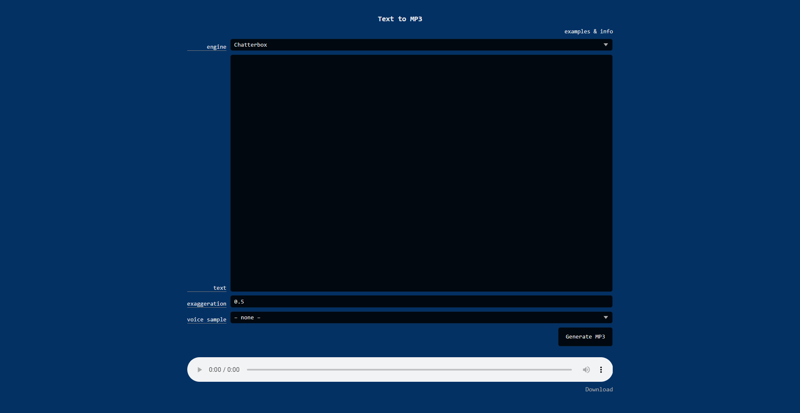

# TTS

A quick local text-to-speech web UI. Three engines, multi-voice speaker tags, MP3 output.



## Engines

| Engine                | Speed     | Method                          |
| --------------------- | --------- | ------------------------------- |
| **Chatterbox**        | slow      | voice cloning from audio sample |
| **Kokoro 82M**        | fast      | pre-trained voice models        |
| **Qwen3 VoiceDesign** | very slow | text description → voice        |

## Requirements

- Python 3.10+
- Node.js
- CUDA GPU (strongly recommended)
- [ffmpeg](https://ffmpeg.org/download.html) on PATH

## Setup

```bat
setup.bat
```

Downloads model weights automatically on first use (~300 MB for Kokoro, larger for Chatterbox/Qwen3).

## Run

```bat
run.bat
```

Opens `http://localhost:3776` in your default browser.

## Voice samples (Chatterbox)

Drop `.mp3`/`.wav` files into `voice_samples/` — they appear in the voice dropdown.

## Speaker tags

Instead of using the voice dropdown, you can insert `[name]` tags anywhere in the text to switch voices mid-generation:

```
[geralt] Some text in Geralt's voice.
[narrator] Back to the narrator.
```

For Qwen3, define a voice on first use with a description:

```
[narrator: Calm professional male narrator, slight British accent]
Text here...
```

The sample is saved to `voice_samples/qwen3/` and reused in future generations. Generating again with a tag that includes description will override the saved voice.
